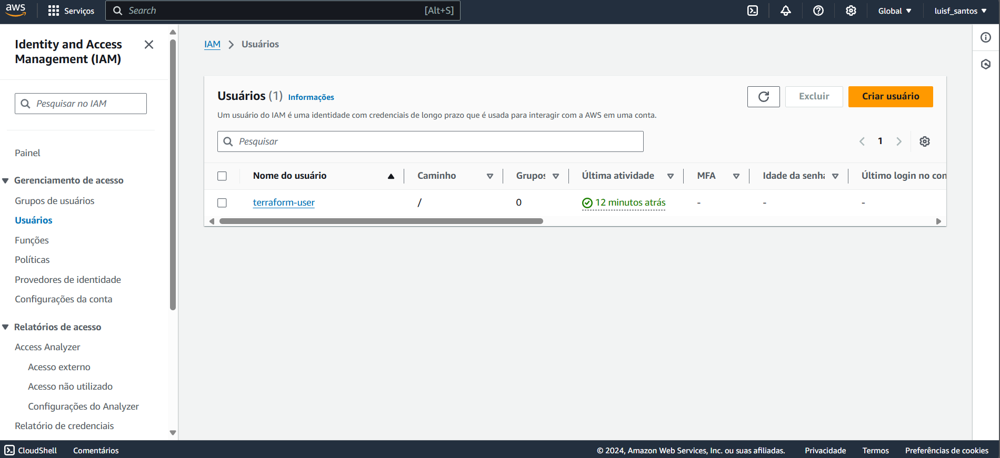

# Terraform IaC AWS

   


## Descrição do Projeto

Este projeto demonstra a criação e gerenciamento de infraestrutura na Amazon Web Services (AWS) utilizando a ferramenta Terraform. O objetivo principal é configurar uma instância EC2 simples, exemplificando o conceito de Infraestrutura como Código (IaC).

## Tecnologias e Ferramentas

- **Terraform**: Uma ferramenta de IaC que permite definir a infraestrutura em código.
- **AWS**: Provedor de nuvem utilizado para o provisionamento de recursos.
- **Git**: Sistema de controle de versão utilizado para gerenciamento do código.

## Objetivos do Projeto

- Aprender os conceitos fundamentais de IaC e Terraform.
- Ganhar experiência prática em gerenciamento de infraestrutura na nuvem.
- Demonstrar habilidades em automação e provisionamento de recursos.

## Destaque suas Aprendizagens

Durante o desenvolvimento deste projeto, eu:

- **Entendi os princípios da Infraestrutura como Código (IaC)**: Aprendi como a IaC pode ajudar a automatizar a criação e gerenciamento de recursos, aumentando a eficiência e reduzindo erros manuais.
- **Familiarizei-me com o Terraform**: Explorei a sintaxe e a estrutura de arquivos do Terraform, aprendendo a definir e aplicar configurações de infraestrutura.
- **Compreendi o funcionamento da AWS**: Aprendi a utilizar serviços da AWS, especialmente o EC2, para entender como funciona o provisionamento de servidores na nuvem.
- **Pratiquei o gerenciamento de versões**: Através do uso do Git, melhorei minhas habilidades em controle de versão e colaboração em projetos de software.


## Estrutura do Projeto

- **main.tf**: Arquivo principal onde a configuração da infraestrutura é definida.

## Fluxo de Trabalho do Terraform


## Configuração do Ambiente

1. **Clone este repositório**:

   ```bash
   git clone https://github.com/LuisFelipe-Santos/Terraform-IaC-AWS.git
   cd Terraform-IaC-AWS
2. Configuração das credenciais da AWS:
Use variáveis de ambiente ou um arquivo de configuração no diretório ~/.aws/.


## Passos para Execução
1. Inicialize o Terraform:

```bash
terraform init
```
2. Planeje as mudanças:

```bash
terraform plan
```
3. Aplique as configurações:

```bash
terraform apply
```
4. Verifique a instância EC2 criada no console da AWS.

5. Limpeza de Recursos
Para evitar custos, destrua os recursos criados:

```bash
terraform destroy
```

### Imagens do projeto

1. **Init do Terraform**: Uma captura de tela do comando `terraform init`, que mostra a inicialização do projeto e os plugins sendo baixados.
    
2. **Apply do Terraform**: Captura de tela do comando `terraform apply`, mostrando como as configurações estão sendo aplicadas e os recursos estão sendo criados.
    
   
    
4. **Instância EC2**: Uma imagem do console da AWS mostrando a instância EC2 criada, o que ajuda a validar que o Terraform funcionou conforme o esperado.
    
5. **IAM**: Captura de tela do console IAM da AWS, mostrando as credenciais que você configurou, que é uma parte importante da configuração de acesso.
    
   
7. **Destroy do Terraform**: Captura de tela do comando `terraform destroy`, demonstrando como limpar os recursos após o uso.
    

    
   
8. **Código do `main.tf**: Aqui está o código da configuração da infraestrutura que criamos

   

## Conclusão
Este projeto me permitiu entender melhor a Infraestrutura como Código e o uso do Terraform na automação de provisionamento na nuvem. Estou animado para aplicar esses conhecimentos em projetos futuros e expandir minhas habilidades em nuvem.
